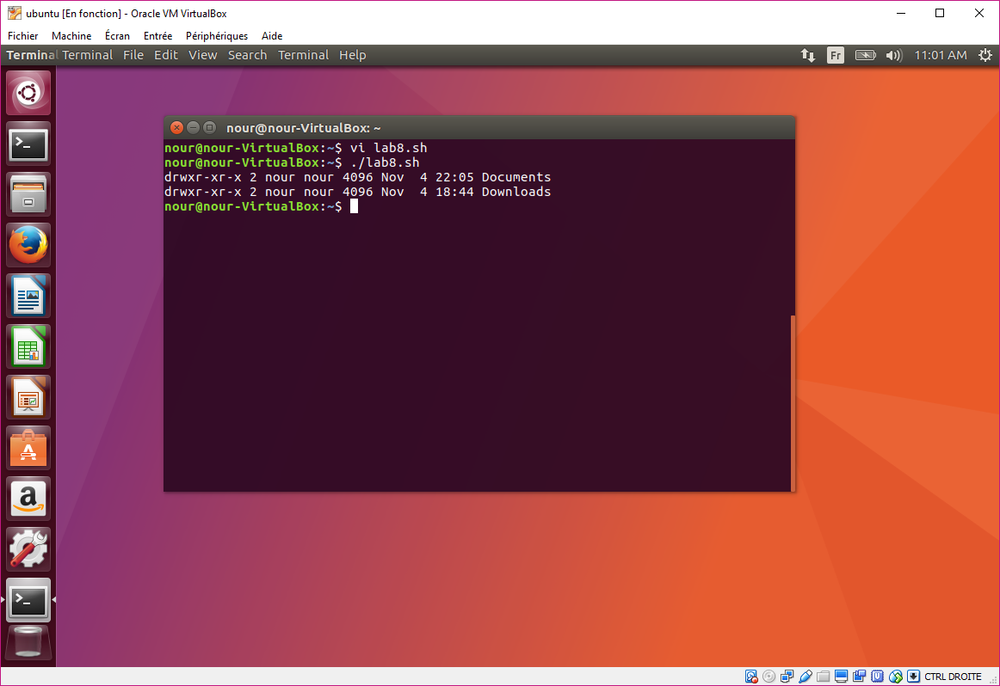
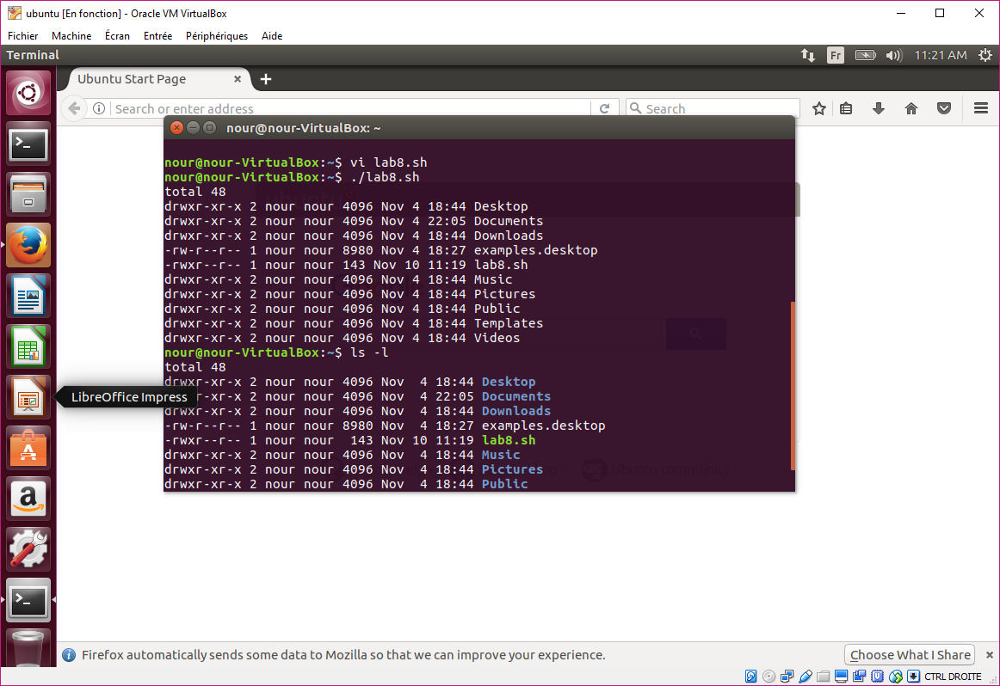
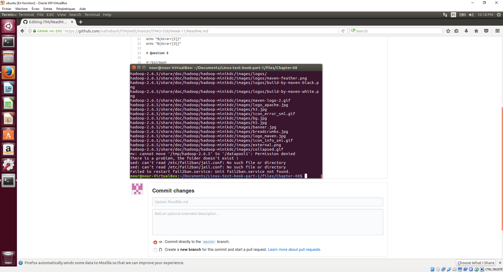
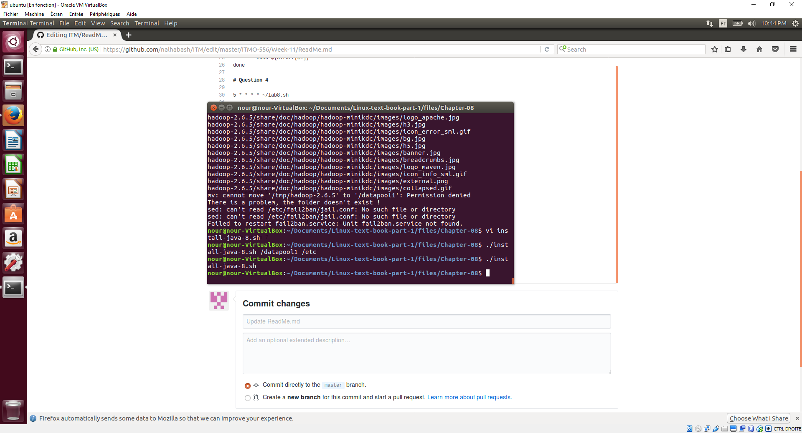
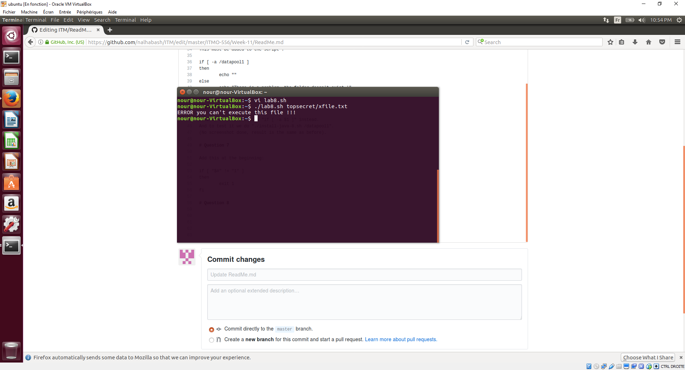
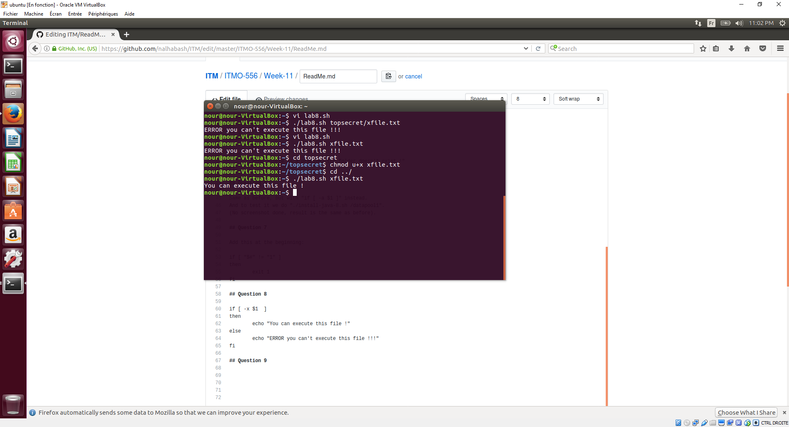
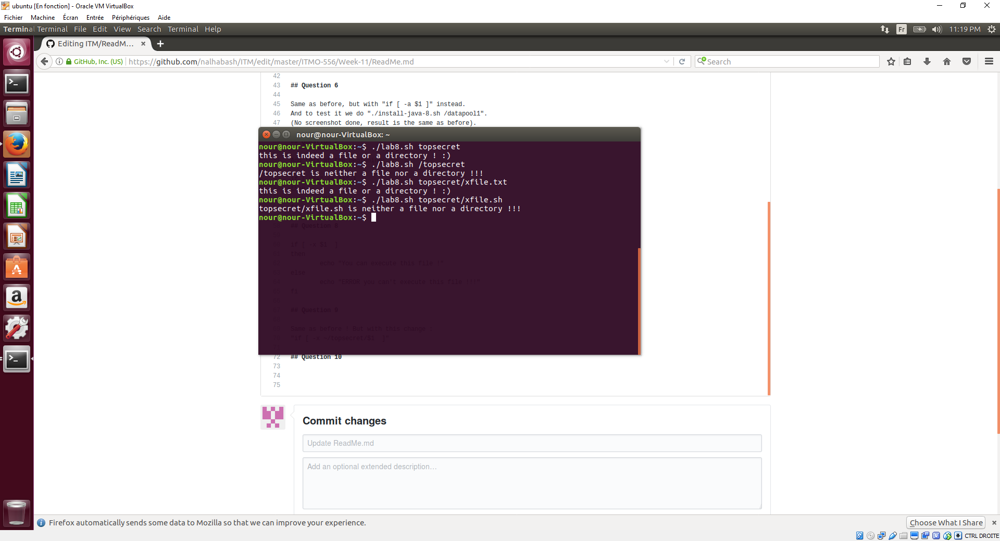
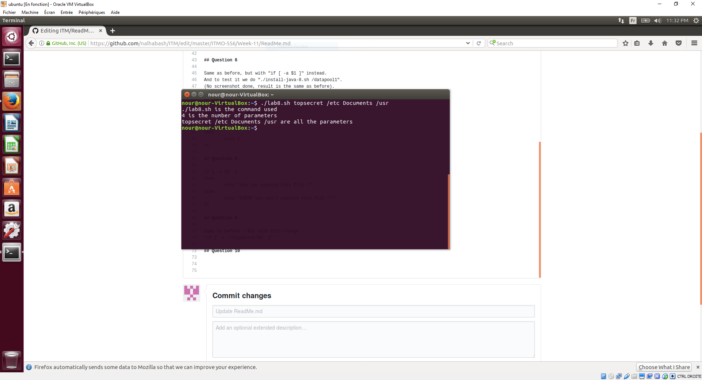

## Question 1:

declare -a itemARRAY

## Question 2:

#!/bin/bash

declare -a dirarr   
mapfile -t dirarr < <(ls -l ~)   
echo "${dirarr[2]}"   
echo "${dirarr[3]}"   

## Question 3

#!/bin/bash

declare -a dirarr   
mapfile -t dirarr < <(ls -l ~) 

LENGTH=${#dirarr[@]}   

for ((i=0; i<${LENGTH}; i++))   
do  
        echo ${dirarr[$i]}  
done   

## Question 4

5 * * * * ~/lab8.sh

## Question 5

This must be added to the script : 

if [ -a /datapool1 ]  
then  
        echo ""  
else  
        echo "There is a problem, the folder doesn't exist !"  
fi  

## Question 6

Same as before, but with "if [ -a $1 ]" instead.
And to test it we do "./install-java-8.sh /datapool1".
(No screenshot done, result is the same as before).

## Question 7

Add this at the beginning:  

if [ "$#" != "1" ]  
then 
        exit 1  
fi  

## Question 8

if [ -x $1  ]  
then  
        echo "You can execute this file !"  
else  
        echo "ERROR you can't execute this file !!!"  
fi  

## Question 9

Same as before ! But with this change : 
"if [ -x ~/topsecret/$1  ]"

## Question 10

if [ -f $1 ] || [ -d $1 ]  
then  
        echo "this is indeed a file or a directory ! :)!"  
else  
        echo "$1 is neither a file nor a directory !!!"  
fi  

## Question 11 

echo "$0 is the command used"  
echo "$# is the number of parameters"  
echo "$@ are all the parameters"  

## Question 12

5 * * * * ~/lab8.sh &>~/Documents/my.log
