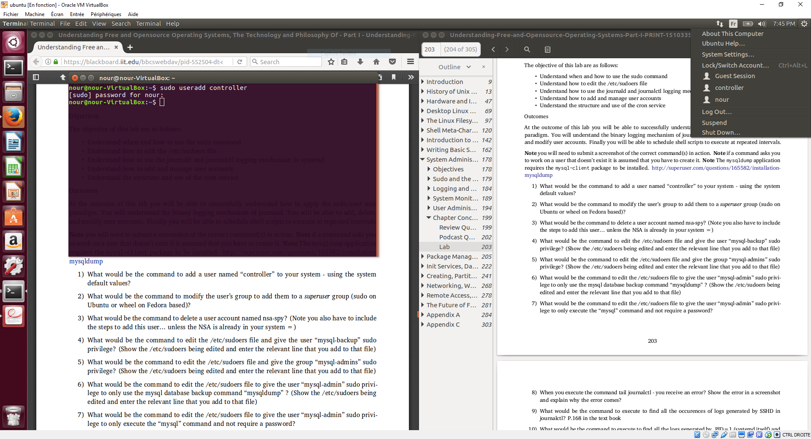
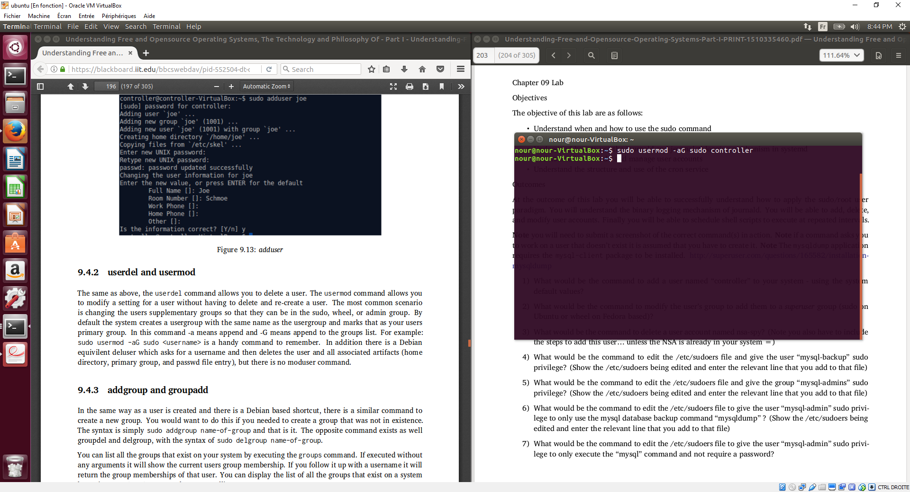
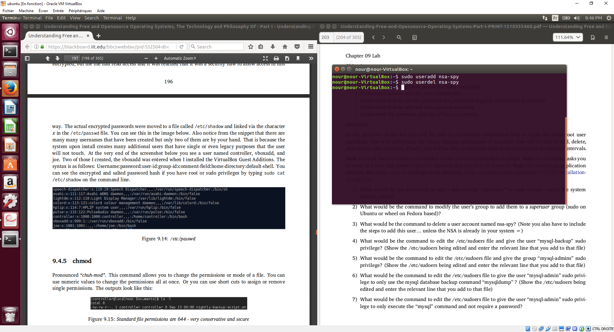
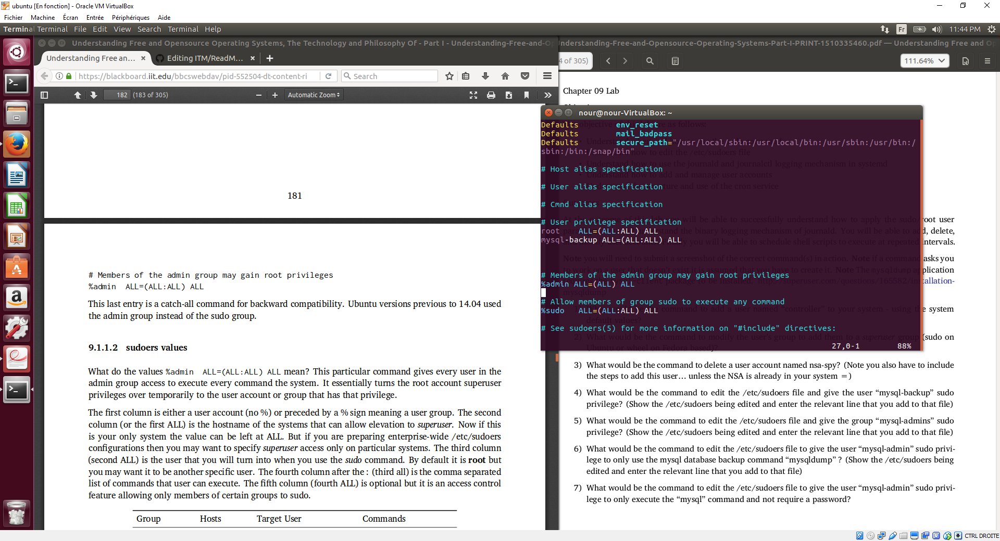
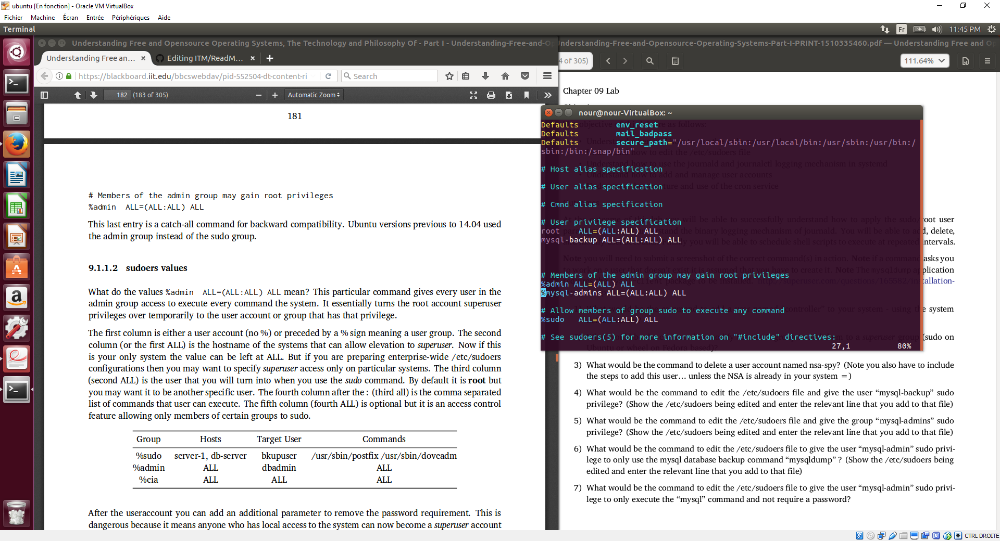
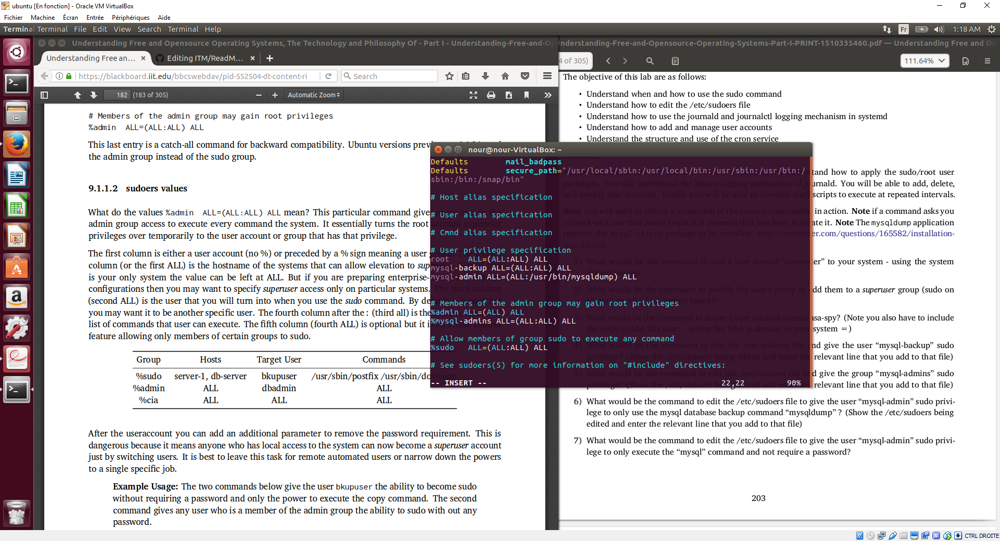
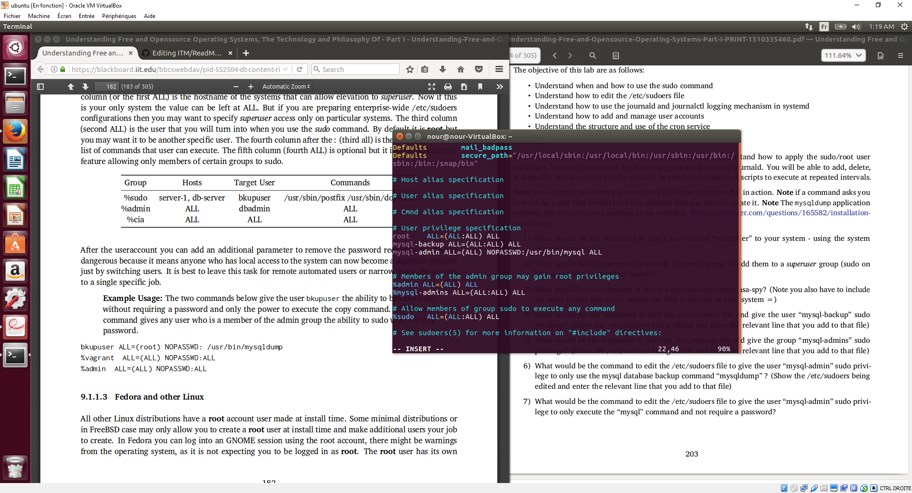
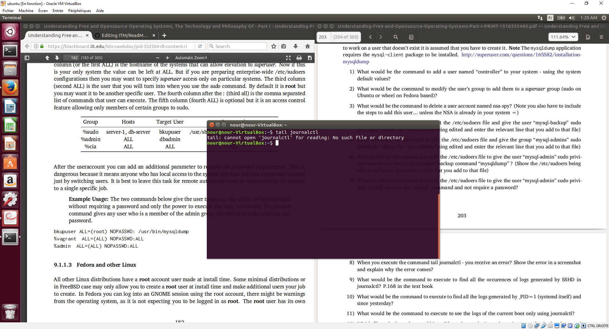
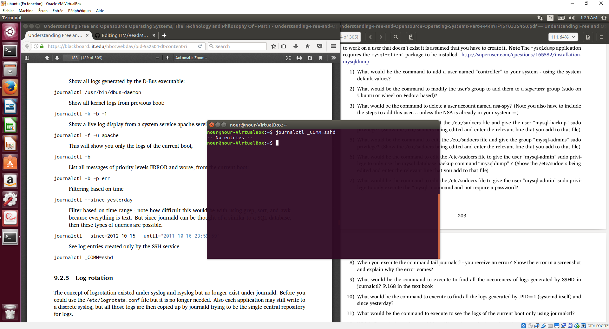
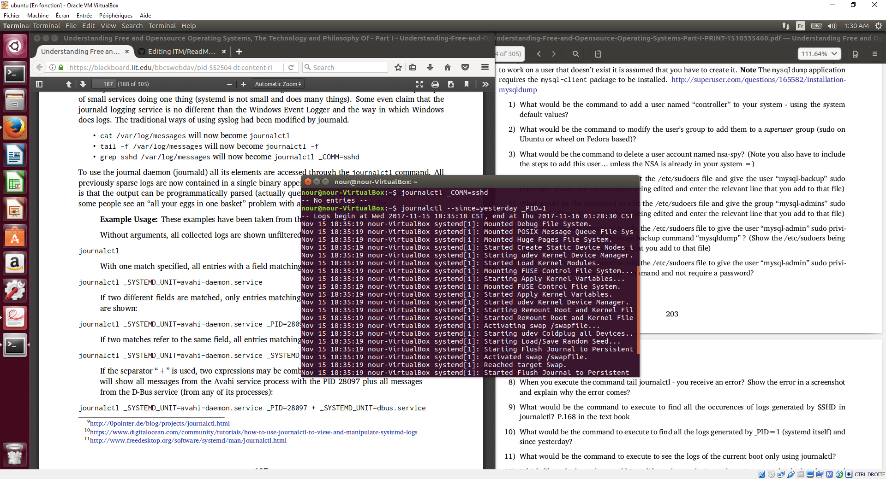

# Chapter 09 LAB

## Question 1

sudo useradd controller

## Question 2 

sudo usermod -aG sudo controller

## Question 3

sudo useradd nsa-spy  
sudo userdel nsa-spy

## Question 4

sudo visudo  
then add "mysql-backup ALL=(ALL:ALL) ALL" in the editor

## Question 5

sudo visudo  
then add "%mysql-admins ALL=(ALL:ALL) ALL" in the editor

## Question 6

sudo visudo  
then add "mysql-admin ALL=(ALL:/usr/sbin/mysqldump) ALL"

## Question 7

sudo visudo  
then add "mysql-admin ALL=(ALL) NOPASSWD:/usr/bin/mysql ALL"

## Question 8

Yes there is an error. Because journalctl isn't a file but a command, and the tail command takes a file as an argument.  

## Question 9

journalctl \__COMM=sshd

## Question 10

journalctl --since=yesterday _PID=1

## Question 11

## Question 12

## Question 13

## Question 14

## Question 15

## Question 16

## Question 17

## Question 18
 

