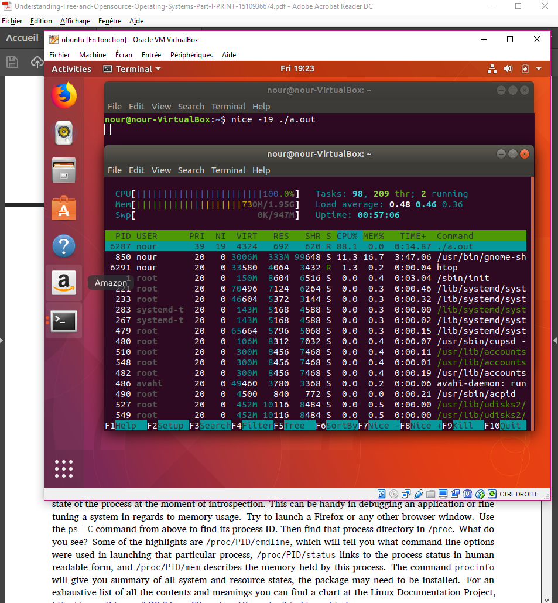

# Chapter 11 - Lab 2

## Question 1:

First, "sudo vi /etc/default/grub" to edit the file in root mode (then :wq! to save and quit instead of :wq).

Then sudo update-grub to save the modifications.

Here's GRUB with a new background :

And the start-up with details:

## Question 2:

## Question 3:

sudo dnf install mariadb  
systemctl -a (to display the services), but I can't find mariadb.service. Tried installing mariadb-server too, as stated here (https://fedoraproject.org/wiki/MariaDB).  
Then :
systemctl enable mariadb  
systemctl start mariadb

You can see it is activated and running: 

## Question 4

As you can see the boot time takes much more time, but it's probably mainly due to me using Fedora this time ! I started this lab on ubuntu..

## Question 5

It seems mariadb increased the boot time by almost 15 seconds.

## Question 6

## Question 7

sudo systemctl kill -s SIGHUP httpd
As you can see the service isn't running anymore:

## Question 8

I thought at first I need to do systemctl isolate graphical.target. But that displayed a black screen and nothing happens. The black screen stays even after a reboot so I don't know who to solve it.
So I changed to ubuntu and did this:

## Question 9

The fact that the values are blank might be due to me changing to a vey recently newly installed ubuntu, with a lot of packages not installed..

## Question 10

Here's the short C code I did, compiled and executed:

The low priority test of the code:

The high priority test of the code:

## Question 11

ps -ef to display the list. (Yes, killing the processes did close the browser, I took the screenshot afterwards)

## Question 12

Here's the result displayed (it's actually better to search for vb.* instead of vb*)

## Question 13

## Question 14

cat /proc/cpuinfo | grep flags

## Question 15

## Question 16

## Question 17

## Question 18

## Question 19

