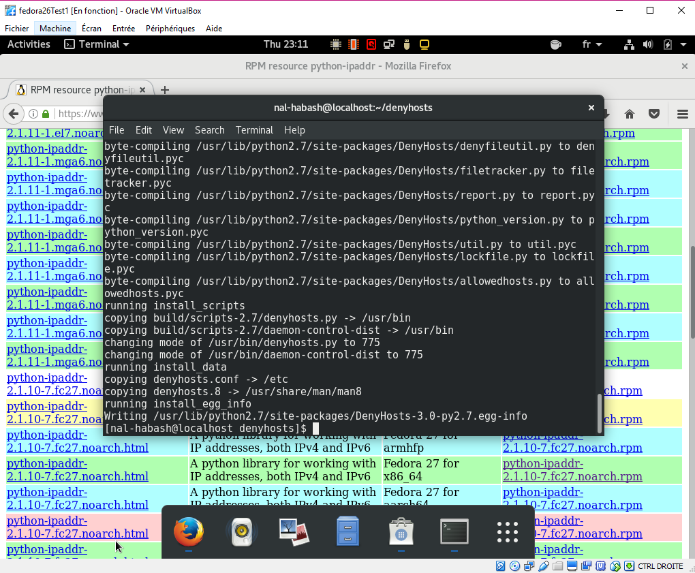
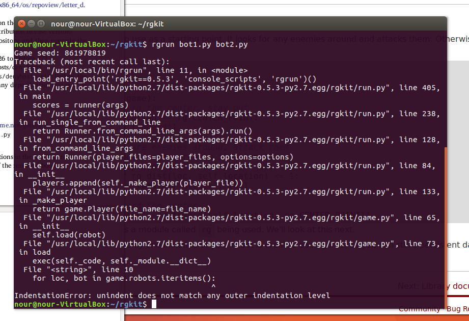

# LAB Chapter 10 - Package Managers

## Question 1:

First downloaded the tarball and unziped it. Then following Install steps I realized I need APR then PRCE libraries so I installed their packages with APT.

## Question 2:

yum install xeyes

## Question 3:

To enable RPMFusion for free: sudo dnf localinstall --nogpgcheck http://download1.rpmfusion.org/free/fedora/rpmfusion-free-release-$(rpm -E %fedora).noarch.rpm  
To enable RPMFusion not for free:  sudo dnf localinstall --nogpgcheck http://download1.rpmfusion.org/nonfree/fedora/rpmfusion-nonfree-release-$(rpm -E %fedora).noarch.rpm 

Then for VLC: sudo dnf install vlc
And to launch it: vlc

## Question 4:

I looked for the name of the dropbox package with "sudo dnf search dropbox" since "sudo dnf install dropbox" didn't find anything.  
Then I found it and installed it: "sudo dnf install python-dropbox.noarch  

## Question 5:

sudo apt-get upgrade

## Question 6:

sudo do-release-upgrade

## Question 7:

sudo apt edit-sources  
Then add this line "deb http://linux-libre.fsfla.org/pub/linux-libre/freesh/ freesh main"  
Then fetch and install the GPG key with wget https://jxself.org/gpg.inc  
Then check that the key is right with "gpg --with-fingerprint gpg.inc" it should display "Key fingerprint = F611 A908 FFA1 65C6 9958 4ED4 9D0D B31B 545A 3198"  
sudo apt-key add gpg.inc then rm gpg.inc

Finally sudo apt update then sudo apt install linux-libre. Here's what it looks like during the installation:  

And to switch to the Linux-libre kernel we need to reboot and select it in Grub.

## Question 8:

sudo dnf upgrade --refresh

## Question 9:

I had to install the ipadrr module first.
Then, in the denyhosts directory: sudo python setup.py install  

## Question 10:

I installed the setup.py in the rgkit directory. Needed me to install the python-setuptools package first.  
However when I tried to run the 2 bots in the game there was an error I couldn't solve:

## Question 11:

There I tried installing pandoc from the software manager, without using the shell. But in the software manager clicking on "installing" didn't do anything. 
So I did it with the terminal after all.
Then I had quite a lot of problems installing the Tex live packages. Mainly, it took too much time and I think the installation froze on the texlive-latex-extra package, since the terminal didn't change after 5 hours.

So when I tried the command in displayed an error, and I couldn't display the book in PDF. 

## Question 12:

sudo yum install httpd php php-common php-cli php-fpm

## Question 13:

Here I followed all the instructions, but nothing appeared in the browser.

