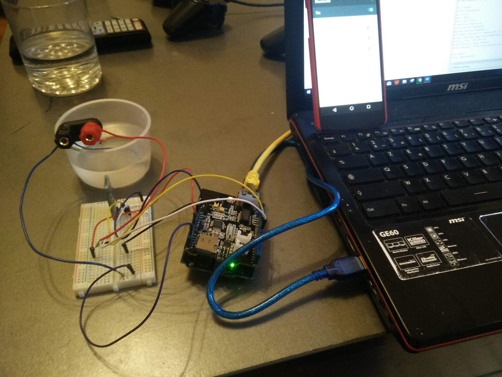
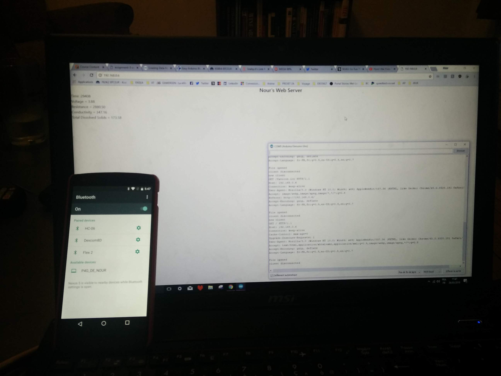
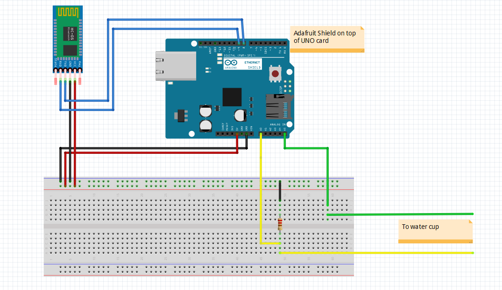

# Smart Ionization Probe
In this project I built a Smart Ionization Probe system connected to a web server and to a phone via bluetooth. 
I used an arduino UNO card, an SD card and an Ethernet Shield from Adafruit, as well as well as some wires, aluminum foil and a resistor.
Here are 2 pictures of the final setup and the display on the web server.

The goal was to measure the conductivity of water in a certain cup using the 2 ends of the probe. The tension value (between 0 and 5 V) allows us to calculate the conductivity value. Then we had several goals:
+ Store the data in a SD card
+ Make a web server to display the data from a browser
+ Send the data using a bluetooth dongle to display it on a receiver (in this case my android phone).

Here's a fritzing sketch of my project: 

## How it works

So once the card is powered with the battery power module, a message displays on the screen and the buzzer plays a starting melody as the lights blink happily. 
