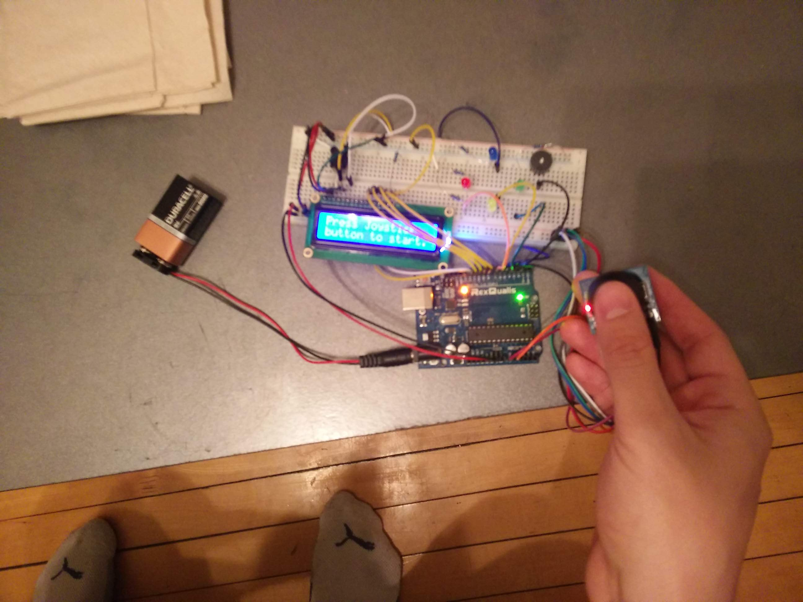
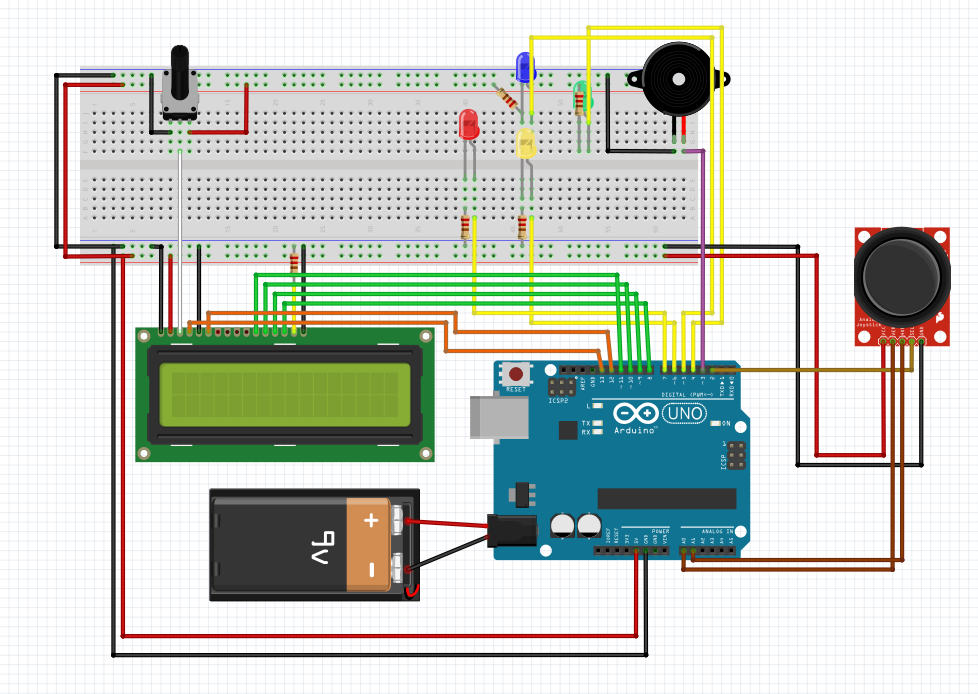

# Simon Game Project

The Simon Game is a well-known memory game where a device displays sequences of elements (lights, digits, or other), that the player must then repeat in the same order without mistakes with the given input.

I have done this project using an Arduino UNO board for the Embedded Systems class.

First, here's a picture of the completed project :

So I chose to use a joystick module for the user input, as it was in the kit I purchased. I also like it since it makes me think of arcade and video games, which is related to this game project.  
The project follows all of the requirements, such as using 4 LEDs, a LCD screen and a piezo buzzer for audio output (and an analog input device)

Here's a fritzing sketch of my project: 

## How it works

So once the card is powered with the battery power module, a message displays on the screen and the buzzer plays a starting melody as the lights blink happily. 

I must mention that the user can change the LCD screen contrast using the potentiameter on the breadboard.

Then to start the game the user must use the joystick. All controls are with the joystick.
She or he must push the joystick button  (makes a distinctive "click") to start the game.  

Then starts level 1, where a sequence of 1 light is shown and the user must repeat it. 
If done correctly, the next level sequence plays. At level k, a sequence of k lights will appear.

Also, at each level, the lights appear 50ms faster. Original light appearance time is 1200ms. Should be 200ms by level 20.

To complete the game, the player must reach the final level (set with the levelMax variable at 20). If completed, a victory message displays on the screen, then the player is brought to the home screen where he can play again by pushing the joystick button.

If the player makes a mistake, he loses: a sad melody is played by the buzzer and a Game Over displays on the screen, and the player is brought back to the home screen where he can retry a new game.

Additional Features: The portable power source (battery) and the increasing difficulty as the player passes each level.

Additional planned feature: I was very focused on the AP Project, but if I had more time I would have 3d printed a case for the game, or maybe built something out of cardboard.

