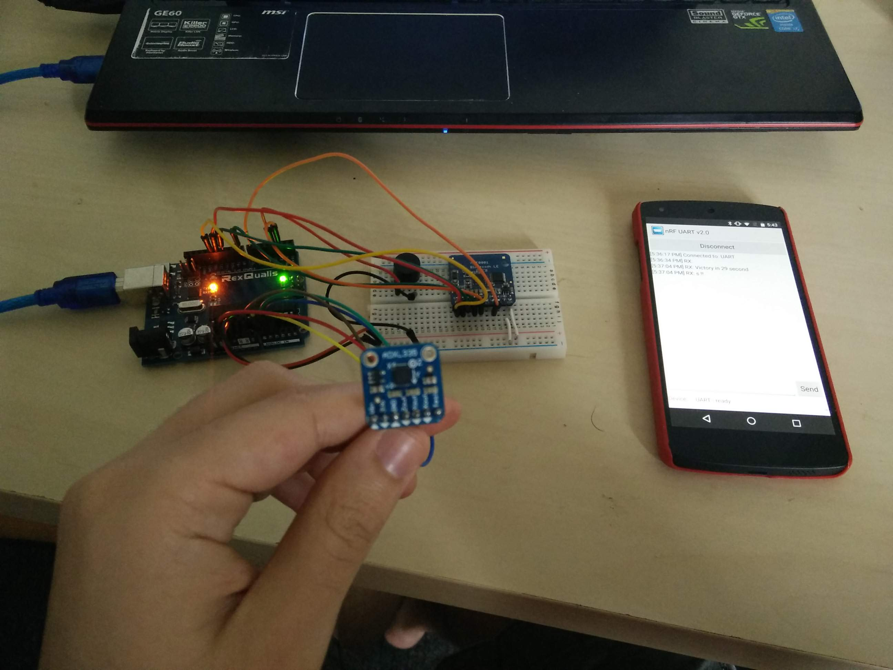
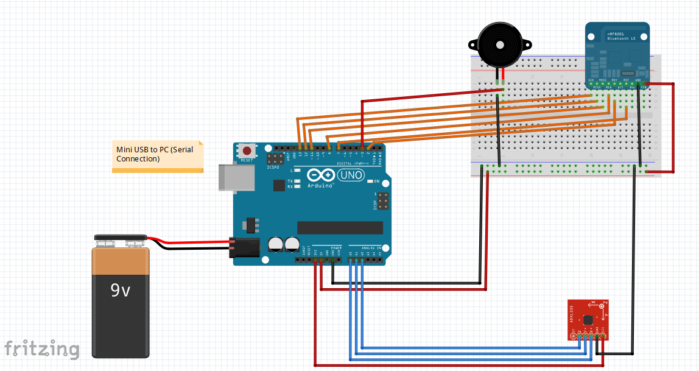
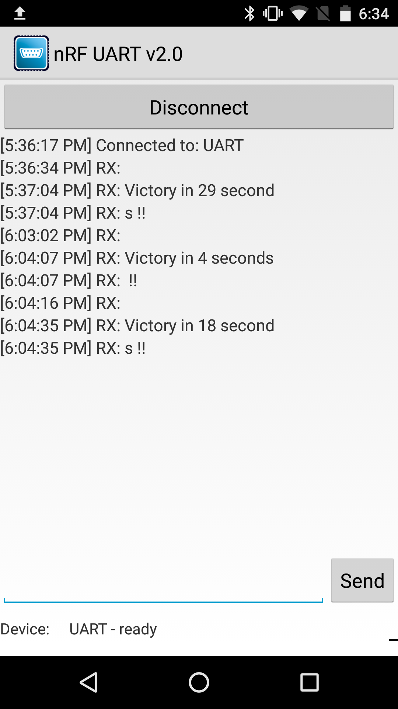

# Final Project - Arduino Game Controller for Unity

I chose to design and build a motion sensor game controller for Unity, using Arduino. This is the final project I chose to work in the Embedded Systems class.

I wanted to do that because I have played a lot of videogames on various platforms in my life, and I was always fascinated by the many innovative controllers that developers often came up with (Duck Hunt Pistol on NES, Wii Remote and Wii Fit, VR controllers,...).

So I chose to make my own controller to play on my own game I also built myself.
I would actually say that this is more than a normal arduino project, since it combines skills and programming knowledge in Unity (using C#).

I first made my own game in Unity, a "Roll a Ball" game that you can learn to make with an interactive tutorial in the Unity documentation. The original finished game uses the arrows on the keyboard to move the ball and gather the collectibles. 

The goal is to control the ball using an accelerometer sensor plugged to an Arduino, that sends the geometrical data to Unity on my laptop. Here's a picture of the final setup:

The controller is wired to the laptop (USB). At first I wanted to go for a wireless controller (Bluetooth connection) but I didn't have the time to solve the latency issues that ensued. 

Now here's a sketch of the hardware I used.

As you can see there still is a bluetooth module. It sends a "victory" message (with the score) to an Android Phone. The phone first needs to be connected to the arduino first. Here is a screenshot of the phone connected to the controller, at the end of a game !

The score is the time in seconds it takes the player to collect all yellow orbs. The game is quite simple, as you can see.
Here's a picture of the game UI:

And now a picture of the game once all orbs are collected ! (with the score displayed in the upper right corner, and a Victory message that displays).

Now I also wanted to save the score and the player name (yes, the player can input his/her name in the script attributes). At first, I wanted to save them in an SD card, like old gaming consoles used to do with memory cards. But instead, I save them in a stuff.txt file on the hard drive (like newer consoles who save data in a hard drive).
Here's how it looks like:

